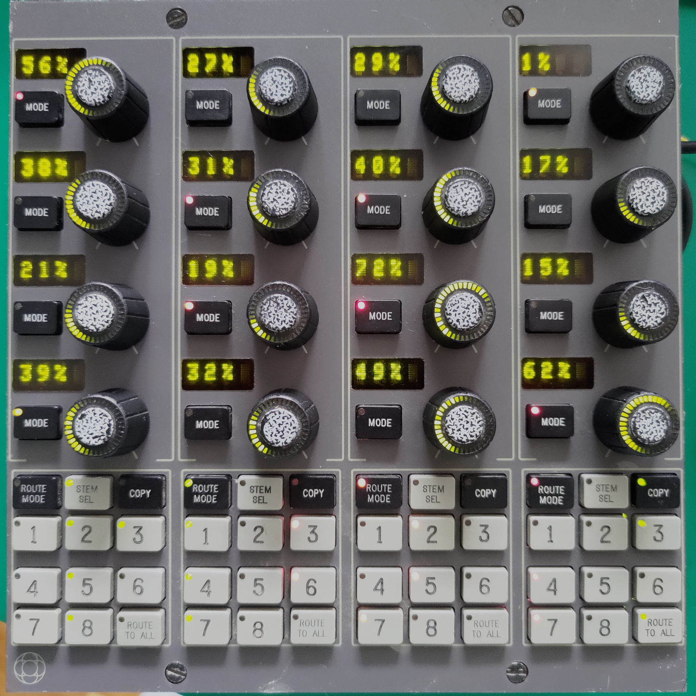

#About this repo

This repo describes and has examples on how to interface with a module I got from
Apex Electronix in LA. It has 16 rotary encoders, lots of buttons and LEDs and 16
4-character 5x7 LED screens. Fun stuff!

Note: The module is from an AMS Neve DFC3D, which is a 'if you need to ask, you cannot
afford it' priced digital audio workstation.

The module has some markings on it. I'll note some of them so the Internet search engines 
will point other people with this module here:

 - MN812-111 ISS4 CHAN QUAD LAYER 3. The last '11' characters are manually crossed through and '55' is written underneath
 - MW812, crossed through
 - B4T9738
 - MicroTech B.B.T sticker
 - KIT 65513 sticker
 - Allgood 08751
 - MW812-095-ISS-5 (crossed through) LOGIC DISPLAY BOARD.
 - SMW-812-157, hand-written

#Module hardware

The three modules have separate subsystems:

 - 16 rotary encoders, read by two custom ASICs on the bottom board
 - LED rings around the encoder shafts, controlled by discrete logic on
   the middle PCB. The LED intensity is dimmable.
 - Buttons on the top PCB. These are read by a microcontroller on the
   bottom PCB.
 - LEDs under the buttons on the top PCB. The control logic for this 
   partially is presumed to be on the middle PCB. The global intensity
   of the red and green LEDs can be set separately
 - Character displays on the top PCB. These are controlled by the
   XC3020A FPGA on the bottom PCB.

Note that the character displays don't work out of the box, as the FPGA
needs a bitstream to be uploaded via the host connector.

Back 64-pin connector: Two rows, A and B. A is closest to the rotary encoders,
B is closest the edge of the PCB. Pin 1 of both rows is towards U35.

Pin	|	A		|	B
---	|	---		|	---
1	|	GND		|	GND
2	|	5V		|	5V
3	|	/RST	|	ID3A
4	|	nc		|	ID2A
5	|	unk1	|	ID1A
6	|	unk2	|	ID0A
7	|	nc		|	nc
8	|	nc		|	nc
9	|	nc		|	nc
10	|	nc		|	nc
11	|	GND		|	GND
12	|	/CS0	|	D15
13	|	R/nW	|	D14
14	|	/CS1	|	D13
15	|	CLK		|	D12
16	|	GND		|	GND
17	|	ID3B	|	D11
18	|	ID2B	|	D10
19	|	ID1B	|	D9
20	|	ID0B	|	D8
21	|	GND		|	GND
22	|	A7		|	D7
23	|	A6		|	D6
24	|	A5		|	D5
25	|	A4		|	D4
26	|	GND		|	GND
27	|	A3		|	D3
28	|	A2		|	D2
29	|	A1		|	D1
30	|	A0		|	D0
31	|	5V		|	5V
32	|	GND		|	GND

The module does not have an internal clock generator. Clock needs to be supplied on
pin A15. It is unknown what clock specifically was used, but it's not critical:
I used 8MHz since the MCU on the main PCB is specified up to that frequency.

# Using this software

This sofware is written for an ESP32-S3 board. It has an API for interfacing with the
module, as well as a basic demo: rotary encoders show a percentage and light up, pressing
a button changes the color of its LED. All this is written for ESP-IDF v5.0.4, although
other versions may work as well.

Pin mappings are defined in main/audbrd_bus.c, and by default are:

ESP pin|Bus signal
 --- | --- 
14 | D0
13 | D1
12 | D2
11 | D3
10 | D4
9  | D5
46 | D6
3  | D7
8  | D8
18 | D9
17 | D10
16 | D11
15 | D12
7  | D13
6  | D14
5  | D15
21 | A0
47 | A1
48 | A2
45 | A3
35 | A4
36 | A5
37 | A6
38 | A7
39 | /CS0
40 | R/nW
41 | /CS1
0  | CLK
EN | /RST
5V | 5V
GND| GND

Also, make sure to ground all IDxA/IDxB lines as well as the unk1/unk2 lines.

# Interfacing with the module

Logically, the main feature here is a parallel bus featuring 16 bidirectional data lines,
8 address lines, two /CS pins (at least, I assume that that's what those are), and a R/nW
line. It addresses 256 registers. The modules all seem to be connected to the same
bus, but the IDxx pins seem to be used to select an individual module: presumably, all
modules had a different value on the IDxA pins and some higher address pins were connected
to the IDxB pins; the module only responds if these two match. To make a single module
respond, simply make the two sets of pins have the same values; I grounded all the
IDxA and IDxB pins to achieve this. There's two unknown pins (unk1 and unk2) which value
doesn't seem to matter for the workings of the device; I connected both to 5V but grounding
them works as well.

To write to a register:

 - Put data on D0-D15
 - Put address on A0-A7
 - Make R/nW low
 - Make /CS0 and /CS1 low
 - Make /CS0 and /CS1 high.

To read from a register:

 - Make D0-D15 high-impedance
 - Put address on A0-A7
 - Make R/nW high
 - Make /CS0 and /CS1 low
 - Read data on D0-D15
 - Make /CS0 and /CS1 high.

The address space is as such: (addresses in hex)
 * 00-80: FPGA address space
 * 80-8F: (R) Return the value of a rotary encoder. Reading also resets the value to 0.
 * 80-8F: (W) Set the LEDs around the rotary encoder ring to the 15-bit data value written.
 * A0-A7: (W) Set the LEDs under the buttons
 * F0: Send bit 0 to FPGA, make FPGA CCLK low
 * F1: Send bit 0 to FPGA, make FPGA CCLK high
 * F2: Accessing this resets the FPGA for loading a new bitstream.
 * FA, FB: Dim setting for the LEDs around the rotary encoder. Brightness seems to be
     max(FA, FB). 00 is full on, FF is very dim.
 * FC: Dim setting for the red button LEDs. 00 is full on, FF is very dim.
 * FD: Dim setting for the green button LEDs. 00 is full on, FF is very dim.
 * FE: (W) Bit 15: Button controller enable.
 * FE: (R) Get scancode. A pressed button N generates 0xFF80+n, a released button generates N.

# The FPGA

The module does not have a FPGA bitstream, so after power-up the character
displays are inert. You need to upload a bitstream to the FPGA for it to do
anything. A compatible bitstream is included here; note that the bitstream is
created from scratch and as such the register layout it provides probably is
not the same as the layout provided by the 'official' bitstream.

To upload the bitstream, you need to send it bit-wise to the FPGA. To send a bit,
you first write it to register F0 and then to register F1. To send the bitstream:

 - Open the audsch.bit file.
 - Skip the header. Simply search for '0xff 0x20'; these will be the first two 
   non-header bitstream bytes.
 - Reset the FPGA by writing anything to register F2
 - Send the bitstream as bits, bit for bit, MSB first.
 - Send 32 dummy bits

After you've done this, the character displays should light up with random data that
happens to be in the framebuffer SRAM.

After the bitstream is loaded, the following registers will be available:

 * 00-04: Column data
 * 08: Character select

You can show a particular character by writing the position to register 08, then writing
the 5 columns worth of 7-bit pixel data you want to display to registers 00 to 04.

Note that if you want to tinker with the FPGA load, you'll need Xilinx Foundation 3.1i. You
can get that here: https://archive.org/details/2000-xilinx-foundation-3-1 (Note the
russian textfiles included on the CD if you need a key.) The load is made using schematic
capture, as licenses for the HDL part of ISE3.1i aren't obtainable anymore.

FPGA connections: (Note: RAM IO7 is NC, databus IO7 is NA)

Pin | Signal
--- | ---
1 | GND
2 | RAM A10
3 | RAM A9
4 | RAM A8
5 | RAM A7
6 | RAM A6
7 | RAM A5
8 | RAM A4
9 | BUS A4
10 | FPGA /PWRDN
11 | RAM /WE
12 | RAM CE2
13 | RAM A3
14 | RAM A2
15 | RAM A1
16 | RAM /OE
17 | RAM A0
18 | VCC
19 | RAM /CE1
20 | RAM IO6
21 | RAM IO5
22 | RAM IO4
23 | RAM IO3
24 | CLK 8mhz
25 | M1
26 | M0/J6
27 | M2/J6
28 | nc
29 | BUS A3
30 | nc
31 | BUS A2
32 | BUS A0
33 | BUS A1
34 | /INIT
35 | GND
36 | nc
37 | BUS A5
38 | nc
39 | LED Dclk
40 | nc
41 | LED col4
42 | LED col2
43 | LED col0
44 | FPGA nRESET
45 | FPGA done/nPG
46 | LED col1
47 | LED col3
48 | BUS D6
49 | BUS D5
50 | BUS A7
51 | BUS D4
52 | VCC
53 | BUS D3
54 | To GAL, low on access to addr < 0x80
55 | BUS D2
56 | BUS D1
57 | LED Din
58 | BUS D0 / FPGA Din
59 | JP6
60 | FPGA CCLK
61 | U19B2 (R/nW)
62 | BUS A6
63 | nc
64 | RAM IO0
65 | RAM IO1
66 | RAM IO2
67 | RAM A12
68 | RAM A11

# Other notes

(not needed for interfacing via the main connector)

- J5 seems to be connected to the Tx/Rx of the MCU, but don't seem to carry any data.
  Perhaps this is for development firmware, or debugging needs to be enabled somehow?
- The character LEDs are green HDSL2000LP displays.
- LED interface: 44-pin. pin 1 = near tantalums
  Button matrix goes directly here
  1, 2, 12, 15, 43, 44 - Gnd
  3, 4 - Vcc
  5, 6 - Vled (mb connects this to Vcc)
  7, 8, 9, 10, 11 - col drivers
  13 - LED data in
  14 - LED clk in
  39 - data in chain of 595s
- The circle LED PCB is a bit weird; it serializes data to de-serialize it around
  the LEDs.
